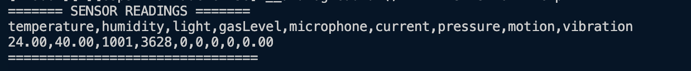

# FIAP - Faculdade de Informática e Administração Paulista

<p align="center">
<a href= "https://www.fiap.com.br/"></a>
</p>

<br>

# Nome do projeto

Enterprise Challenge - Solução para a Hermes Reply - Plataforma inteligente de manutenção preditiva

## Nome do grupo

## 👨‍🎓 Integrantes:

- <a href="https://www.linkedin.com/in/anacornachi/">Ana Cornachi</a>
- <a href="https://www.linkedin.com/in/carlamaximo/">Carla Máximo</a>
- <a href="https://www.linkedin.com/in/lucas-lins-lima/">Lucas Lins</a>

## 👩‍🏫 Professores:

### Tutor(a)

- <a href="https://www.linkedin.com/in/lucas-gomes-moreira-15a8452a/">Lucas Gomes Moreira</a>

### Coordenador(a)

- <a href="https://www.linkedin.com/in/andregodoichiovato/">André Godoi Chiovato</a>

## Objetivo do projeto


Este projeto faz parte do desafio proposto pela empresa Hermes Reply, no contexto do programa Enterprise Challenge FIAP. O problema central consiste em simular um ambiente industrial digitalizado, onde seja possível monitorar variáveis do chão de fábrica e iniciar uma abordagem de manutenção preditiva.

Nosso objetivo é construir uma plataforma funcional, utilizando o ESP32 e sensores embarcados (ou simulados), capaz de capturar informações relevantes de forma automatizada. Em seguida, os dados são analisados e visualizados em gráficos, promovendo insights iniciais que poderiam apoiar tomadas de decisão em tempo real.

## Sensores utilizados

### 🧾 Quadro resumo dos sensores utilizados

| Sensor / Componente        | Pino (GPIO)       | Tipo de Leitura | Finalidade                                    |
| -------------------------- | ----------------- | --------------- | --------------------------------------------- |
| DHT22                      | 15                | Digital         | Temperatura e umidade ambiente                |
| LDR (Fotoresistor)         | 34                | Analógica       | Medição de luminosidade                       |
| MQ2 (Gás)                  | 35                | Analógica       | Detecção de gases combustíveis                |
| PIR (Presença)             | 33                | Digital         | Detecção de movimento humano                  |
| MPU6050 (Acelerômetro)     | SDA: 21 / SCL: 22 | I2C             | Medição de vibração e aceleração              |
| Potenciômetro 1 (Mic)      | 32                | Analógica       | Simula ruído captado por microfone industrial |
| Potenciômetro 2 (Corrente) | 25                | Analógica       | Simula variações de corrente elétrica         |
| Potenciômetro 3 (Pressão)  | 26                | Analógica       | Simula variações de pressão atmosférica       |

A etapa de definição dos sensores foi conduzida com base em critérios técnicos e contextuais sólidos, respeitando tanto os requisitos do desafio proposto quanto os limites impostos pela plataforma de simulação Wokwi. Inicialmente, realizamos uma **pesquisa exploratória em bases de dados industriais no Kaggle**, buscando compreender quais métricas são tradicionalmente monitoradas em equipamentos industriais com foco em manutenção preditiva. Os seguintes conjuntos de dados foram utilizados como referência:

- [Industrial Equipment Monitoring Dataset](https://www.kaggle.com/datasets/dnkumars/industrial-equipment-monitoring-dataset/data)

- [Sensor Maintenance Dataset](https://www.kaggle.com/datasets/ziya07/sensor-maintenance-dataset)

- [Smart Manufacturing Temperature Regulation Dataset](https://www.kaggle.com/datasets/ziya07/smart-manufacturing-temperature-regulation-dataset)

A análise desses datasets nos revelou um conjunto consistente de variáveis amplamente utilizadas na detecção de anomalias e no controle preventivo de falhas em ambientes fabris, incluindo temperatura, vibração, umidade, pressão atmosférica, corrente elétrica, detecção de gases e presença humana. Com base nisso, definimos os sensores a seguir, priorizando máxima cobertura funcional e viabilidade de simulação:

- **DHT22** → Sensor combinado de temperatura e umidade, essencial para controle ambiental
- **LDR** (fotoresistor) → Capta variações de luminosidade, útil em simulações de controle de iluminação ou exposição
- **MQ2** → Sensor de gases inflamáveis (propano, metano, etc.), utilizado para representar qualidade do ar e detecção de vazamentos
- **MPU6050** → Acelerômetro de 3 eixos e giroscópio, amplamente adotado para medir vibração mecânica e deslocamento angular
- **PIR** → Sensor digital de presença, simula movimentação humana no ambiente

Como o simulador Wokwi não oferece componentes como microfones industriais, sensores de corrente elétrica ou barômetros, utilizamos potenciômetros analógicos para simular esses comportamentos de maneira controlável:

- **Potenciômetro 1** → Simula um microfone industrial (representando intensidade de ruído)
- **Potenciômetro 2** → Simula um sensor de corrente elétrica (representando variações em motores ou linhas de alimentação)
- **Potenciômetro 3** → Simula um sensor de pressão atmosférica (útil para condições ambientais ou pneumáticas)

> Em aplicações reais, sensores como microfones piezoelétricos, transformadores de corrente (CTs) e barômetros digitais substituiriam esses elementos simulados, assegurando medições com maior precisão, confiabilidade e aplicação industrial direta. No entanto, os potenciômetros permitem simular comportamentos analógicos semelhantes no Wokwi e garantem a viabilidade da simulação educacional.

Sendo assim, define-se:

- **DHT22** → Temperatura e Umidade
- **LDR** → Luminosidade
- **MQ2** → Detecção de gás
- **MPU6050** → Vibração
- **PIR** → Movimento / presença humana
- **Potenciômetro 1** → Simula um microfone, representando ruídos operacionais
- **Potenciômetro 2** → Simula um sensor de corrente elétrica
- **Potenciômetro 3** → Simula um sensor de pressão atmosférica

## 📁 Estrutura de pastas

```
|src/Industrial Monitoring ESP32 - Reply - FIAP/ # Código ESP32 (PlatformIO)
├── analysis/ # Scripts Python de análise
│ ├── analyze_data.py
│ ├── dados.csv
│ └── requirements.txt
├── src/ # Código fonte da aplicação embarcada
│ └── main.cpp
├── diagram.json # Arquivo da simulação Wokwi
├── wokwi.toml # Configuração da simulação Wokwi
├── platformio.ini # Configurações do PlatformIO
```

## Circuito Elétrico Simulado

O circuito eletrônico foi projetado utilizando o simulador Wokwi, onde cada sensor virtual foi conectado ao ESP32 respeitando seus requisitos elétricos. Pinos analógicos foram reservados para sensores de leitura contínua (potenciômetros, LDR, MQ2), enquanto os digitais foram utilizados para sensores de presença e barramento I2C (MPU6050). O LDR foi conectado em série com um resistor de 10kΩ para formar um divisor de tensão.


Link da simulação no Wokwi: https://wokwi.com/projects/431948542823743489

## Funcionamento do Sistema

A aplicação embarcada foi escrita em C++ com Arduino Framework, e a compilação foi realizada no PlatformIO. A lógica da aplicação foi estruturada da seguinte forma:

1. No método `setup()`, todos os sensores, analógicos e digitais, são inicializados, e a comunicação I2C é estabelecida com o MPU6050.
2. No `loop()`, os sensores são lidos continuamente a cada 2 segundos.
3. As leituras são formatadas como uma linha CSV e impressas no Serial Monitor do PlatformIO.

Esse formato facilita a cópia dos dados diretamente do terminal para posterior exportação para um arquivo .csv, permitindo análises externas.

Cada leitura representa uma simulação em tempo real do comportamento dos sensores embarcados. Esses dados são capturados pelo microcontrolador ESP32 e impressos em tempo de execução no Serial Monitor, com formatação delimitada por vírgula (CSV). Esse formato facilita a coleta estruturada dos dados, que podem ser reaproveitados diretamente para análises externas, por exemplo em ferramentas estatísticas ou scripts Python.

Trecho representativo da geração dos dados em CSV:

```bash
Serial.println("temperature,humidity,light,gasLevel,microphone,current,pressure,motion,vibration");
Serial.print(temperature); Serial.print(",");
Serial.print(humidity); Serial.print(",");
Serial.print(light); Serial.print(",");
Serial.print(gasLevel); Serial.print(",");
Serial.print(microphone); Serial.print(",");
Serial.print(current); Serial.print(",");
Serial.print(pressure); Serial.print(",");
Serial.print(motionDetected); Serial.print(",");
Serial.println(vibration);
```

Resultado no terminal:


## Análise dos Dados e Geração de Gráficos

> ❗ Nota importante sobre simulação: <br/>
> Como este projeto foi desenvolvido exclusivamente na plataforma de simulação Wokwi, não é possível automatizar a gravação dos dados do Serial Monitor diretamente em um arquivo .csv via script Python, uma vez que não há uma porta serial física acessível. A coleta de dados deve ser feita manualmente, copiando o conteúdo exibido no terminal (Serial Monitor) e colando no arquivo analysis/dados.csv. Caso este mesmo projeto seja executado futuramente em um dispositivo ESP32 real conectado via USB, será possível automatizar essa coleta com bibliotecas como pyserial, criando um pipeline direto entre o microcontrolador e o arquivo CSV.

Após a coleta dos dados, o conteúdo do Serial Monitor deve ser copiado e colado no arquivo analysis/dados.csv. Esse arquivo pode ser ajustado manualmente, permitindo testar diferentes cenários e avaliar como as variáveis se comportam visualmente.

Um script em Python (analyze_data.py) foi desenvolvido para automatizar a análise, contendo as seguintes etapas:

1. Lê o dados.csv via `pandas`
2. Conversão em estrutura tabular (DataFrame)
3. Gera três gráficos automáticos com `matplotlib`

As visualizações geradas facilitam a interpretação do comportamento dos sensores em conjunto, reproduzindo um ambiente industrial monitorado digitalmente.

### Gráfico 1: Temperatura e Umidade

Permite observar oscilações térmicas e a relação com a umidade do ambiente, simulando condições climáticas dentro da planta.

Imagem criada a partir dos dados armazenados em analysis/dados.csv:


### Gráfico 2: Gás e Vibração

Avalia a qualidade do ar e os níveis de vibração em motores ou equipamentos, importante para prevenção de falhas mecânicas.

Imagem criada a partir dos dados armazenados em analysis/dados.csv:


### Gráfico 3: Corrente e Pressão

Simula variáveis elétricas e ambientais que podem afetar a performance de máquinas industriais.

Imagem criada a partir dos dados armazenados em analysis/dados.csv:


> As imagens geradas foram salvas como .png e incluídas no repositório.

## 🔧 Como executar o projeto

### Parte 1: Simulação no ESP32

- Baixar dependencias, compilar e executar com PlatformIO

```bash
pio pkg install
pio run
```

### Parte 2: Análise com Python

```bash
cd src/Industrial\ Monitoring\ ESP32\ -\ Reply\ -\ FIAP/src
python3 -m venv .venv
source .venv/bin/activate # ou .venv\Scripts\activate no Windows
pip install -r requirements.txt
python analyze_data.py
```

## Demonstração da simulação no Wokwi: Leitura de sensores industriais com ESP32

Este vídeo demonstra o funcionamento da simulação desenvolvida na plataforma Wokwi, utilizando o ESP32 e múltiplos sensores virtuais. É possível observar a leitura em tempo real de temperatura, umidade, luminosidade, gás, presença, vibração, corrente simulada, ruído e pressão atmosférica.

Os dados são impressos no terminal em formato CSV estruturado, prontos para exportação e análise. Essa estrutura reflete um ambiente industrial digitalizado e serve como base para aplicações futuras de manutenção preditiva com inteligência artificial.

[Clique aqui para assistir à simulação em funcionamento](/assets/simulator.mp4)

## 🗃 Histórico de lançamentos

- 0.1.0 - 25/05/2025
  - Estrutura criada com PlatformIO e simulação integrada no Wokwi
  - Código funcional em C++ com leitura de múltiplos sensores industriais simulados
  - Simulação com ESP32 e sensores analógicos, digitais e I2C
  - Dados gerados no Serial Monitor em formato CSV
  - Script Python para análise e visualização de dados via gráficos
  - Sensores definidos com base em pesquisa de métricas industriais reais
  - Documentação final completa com prints, vídeo e orientações de execução

## 📋 Licença

<p xmlns:cc="http://creativecommons.org/ns#" xmlns:dct="http://purl.org/dc/terms/"><a property="dct:title" rel="cc:attributionURL" href="https://github.com/agodoi/template">MODELO GIT FIAP</a> por <a rel="cc:attributionURL dct:creator" property="cc:attributionName" href="https://fiap.com.br">Fiap</a> está licenciado sobre <a href="http://creativecommons.org/licenses/by/4.0/?ref=chooser-v1" target="_blank" rel="license noopener noreferrer" style="display:inline-block;">Attribution 4.0 International</a>.</p>
