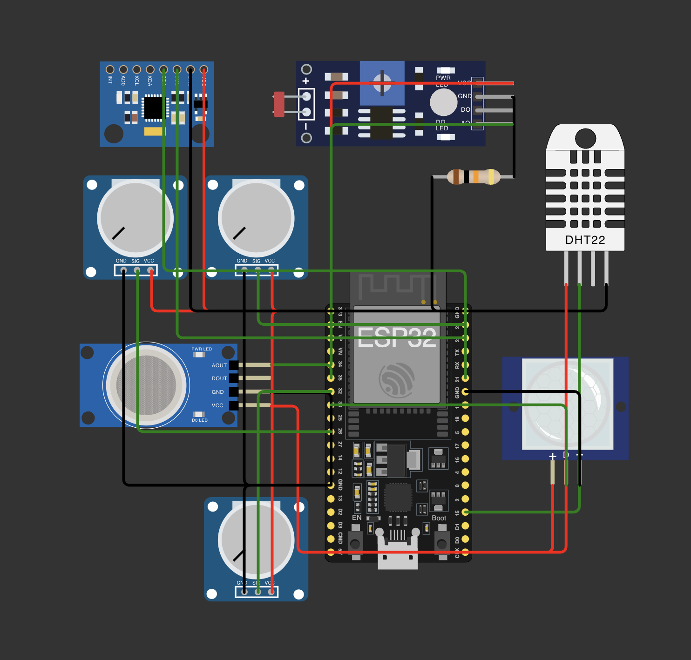

# FIAP - Faculdade de Informática e Administração Paulista

<p align="center">
<a href= "https://www.fiap.com.br/"></a>
</p>

<br>

# Nome do projeto

Enterprise Challenge - Solução para a Hermes Reply - Plataforma inteligente de manutenção preditiva

## Nome do grupo

## 👨‍🎓 Integrantes:

- <a href="https://www.linkedin.com/in/anacornachi/">Ana Cornachi</a>
- <a href="https://www.linkedin.com/in/carlamaximo/">Carla Máximo</a>
- <a href="https://www.linkedin.com/in/lucas-lins-lima/">Lucas Lins</a>

## 👩‍🏫 Professores:

### Tutor(a)

- <a href="https://www.linkedin.com/in/lucas-gomes-moreira-15a8452a/">Lucas Gomes Moreira</a>

### Coordenador(a)

- <a href="https://www.linkedin.com/in/andregodoichiovato/">André Godoi Chiovato</a>

## Objetivo do projeto

Este projeto faz parte do desafio proposto pela empresa Hermes Reply, no contexto do programa Enterprise Challenge FIAP. O problema central consiste em simular um ambiente industrial digitalizado, onde seja possível monitorar variáveis do chão de fábrica e iniciar uma abordagem de manutenção preditiva.

Nosso objetivo é construir uma plataforma funcional, utilizando o ESP32 e sensores embarcados (ou simulados), capaz de capturar informações relevantes de forma automatizada. Em seguida, os dados são analisados e visualizados em gráficos, promovendo insights iniciais que poderiam apoiar tomadas de decisão em tempo real.

## Sensores utilizados

Para representar um ambiente fabril completo, optamos por sensores que monitoram variáveis ambientais e operacionais. Contudo, como o simulador Wokwi possui um conjunto limitado de componentes, utilizamos potenciômetros para simular sensores não disponíveis:

- DHT22 → Temperatura e Umidade
- LDR → Luminosidade
- MQ2 → Detecção de gás
- MPU6050 → Vibração
- PIR → Movimento / presença humana
- Potenciômetro 1 → Simula um microfone, representando ruídos operacionais
- Potenciômetro 2 → Simula um sensor de corrente elétrica
- Potenciômetro 3 → Simula um sensor de pressão atmosférica

> Em um cenário real, sensores específicos de corrente, microfone industrial ou barômetro seriam utilizados. No entanto, os potenciômetros permitem simular comportamentos analógicos semelhantes no Wokwi.

## 📁 Estrutura de pastas
```
|src/Industrial Monitoring ESP32 - Reply - FIAP/ # Código ESP32 (PlatformIO)
├── analysis/ # Scripts Python de análise
│ ├── analyze_data.py
│ ├── dados.csv
│ └── requirements.txt
├── src/ # Código fonte da aplicação embarcada
│ └── main.cpp
├── diagram.json # Arquivo da simulação Wokwi
├── wokwi.toml # Configuração da simulação Wokwi
├── platformio.ini # Configurações do PlatformIO
```
## Circuito Elétrico Simulado

O circuito foi montado na plataforma Wokwi, conectando todos os sensores ao ESP32. Cada sensor foi ligado aos pinos analógicos ou digitais adequados, com resistores aplicados quando necessário (ex: para o LDR). A captura de tela da simulação foi realizada após testes de estabilidade.



Link da simulação no Wokwi: https://wokwi.com/projects/431948542823743489

## Funcionamento do Sistema

A aplicação foi desenvolvida em C++ com Arduino Framework, compilada via PlatformIO. No setup() do ESP32, os sensores são inicializados e configurados. No loop(), cada sensor é lido ciclicamente, e os valores são enviados para o Monitor Serial de forma estruturada em CSV:

Trecho representativo:

```bash
Serial.println("temperature,humidity,light,gasLevel,microphone,current,pressure,motion,vibration");
Serial.print(temperature); Serial.print(",");
Serial.print(humidity); Serial.print(",");
Serial.print(light); Serial.print(",");
Serial.print(gasLevel); Serial.print(",");
Serial.print(microphone); Serial.print(",");
Serial.print(current); Serial.print(",");
Serial.print(pressure); Serial.print(",");
Serial.print(motionDetected); Serial.print(",");
Serial.println(vibration);
```

A cada 2 segundos, uma nova linha é registrada. O usuário pode copiar esse output do terminal e colar em um arquivo chamado dados.csv.

## Análise dos Dados e Geração de Gráficos

Após a coleta dos dados, criamos um script em Python (analyze_data.py) que:

1. Lê o dados.csv
2. Analisa colunas numéricas de sensores
3. Gera três gráficos automáticos com matplotlib

### Gráfico 1: Temperatura e Umidade

Permite observar oscilações térmicas e a relação com a umidade do ambiente, simulando condições climáticas dentro da planta.

Imagem criada a partir dos dados armazenados em analysis/dados.csv:


### Gráfico 2: Gás e Vibração

Avalia a qualidade do ar e os níveis de vibração em motores ou equipamentos, importante para prevenção de falhas mecânicas.

Imagem criada a partir dos dados armazenados em analysis/dados.csv:


### Gráfico 3: Corrente e Pressão

Simula variáveis elétricas e ambientais que podem afetar a performance de máquinas industriais.

Imagem criada a partir dos dados armazenados em analysis/dados.csv:


> As imagens geradas foram salvas como .png e incluídas no repositório.

## 🔧 Como executar o projeto

### Parte 1: Simulação no ESP32

- Baixar dependencias, compilar e executar com PlatformIO

```bash
pio pkg install
pio run
```

### Parte 2: Análise com Python

```bash
cd src/Industrial\ Monitoring\ ESP32\ -\ Reply\ -\ FIAP/src
python3 -m venv .venv
source .venv/bin/activate # ou .venv\Scripts\activate no Windows
pip install -r requirements.txt
python analyze_data.py
```

## 🗃 Histórico de lançamentos

- 0.1.0 - 25/05/2025
  - Estrutura do projeto criada com PlatformIO e integração com Wokwi
  - Código funcional para leitura de múltiplos sensores industriais simulados
  - Dados exibidos no Serial Monitor para futura exportação e análise
  - Configuração completa do ambiente com dependências no platformio.ini
  - Ambiente Python configurado com análise e visualização dos dados

## 📋 Licença

<p xmlns:cc="http://creativecommons.org/ns#" xmlns:dct="http://purl.org/dc/terms/"><a property="dct:title" rel="cc:attributionURL" href="https://github.com/agodoi/template">MODELO GIT FIAP</a> por <a rel="cc:attributionURL dct:creator" property="cc:attributionName" href="https://fiap.com.br">Fiap</a> está licenciado sobre <a href="http://creativecommons.org/licenses/by/4.0/?ref=chooser-v1" target="_blank" rel="license noopener noreferrer" style="display:inline-block;">Attribution 4.0 International</a>.</p>
